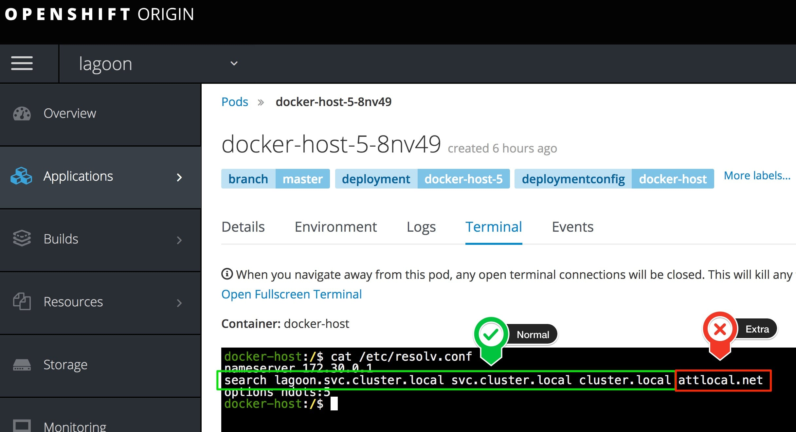

# Development of Lagoon

Development of Lagoon happens locally via Docker. We are using the new [Docker Multi Stage builds](https://docs.docker.com/engine/userguide/eng-image/multistage-build/) very heavily, so it requires at least Docker Version 17.06.1.

## Install Docker

Please check the [official Docs of Docker](https://docs.docker.com/engine/installation/) how to install Docker.

### On Linux Install Docker Compose

Docker compose is included in Docker for Mac installations.  For linux installations see the directions here: [https://docs.docker.com/compose/install/](https://docs.docker.com/compose/install/).

## Install VirtualBox 

We are using VitualBox to run the Openshift Minishift VM. For download and instalation instructions see here:
[https://www.virtualbox.org/](https://www.virtualbox.org/)

## Start Services

1. Add `192.168.99.0/24` to insecure registries in Docker (see [here](https://docs.docker.com/registry/insecure/) how to do that). Also make sure that you give your Docker Host minimum 4 CPUs and 4GB Ram.


Important: Lagoon consists of a lot of Services and Docker Images, building and running them locally might not even be necessary.
We're using make (see the [Makefile](https://github.com/amazeeio/lagoon/blob/master/Makefile)) in order to only build the needed Docker Images specifically for a part of Lagoon.

All of it is based around tests. So if you like to only build the part that is needed to work on the Node.js deployment, you can run the tests with `make tests/node`, this will then setup (openshift, building images, services) all the needed stuff for the Node.js deployment part.

If you would still like to build and start all services, go ahead:

2\. Build images

```sh
make build -j$(getconf _NPROCESSORS_ONLN)
```

3\. start Lagoon Services

```sh
make up
```

4\. Follow the Services logs

```sh
make logs
```

5\. run tests (read [Tests](tests.md) to learn more about testing)
```sh
make tests
```

6\. Look what happens in OpenShift: [https://192.168.99.100:8443/console](https://192.168.99.100:8443/console) (developer/developer)

## Local Development

Most services are written in Node.js. As many of these services share similar Node code and Node Packages, we're using a new feature of yarn, called `yarn workspaces`. Yarn Workspaces needs a package.json in the projects root directory that defines the workspaces.

The development of the services can happen directly within Docker. Each container for each service is setup in a way that it's source code is mounted into the running container (see [docker-compose.yml](../using_lagoon/docker-compose_yml.md). Node itself is watching the code via `nodemon` and restarts the node process automatically on a change.

### lagoon-commons

The services not only share many node packages, but also share actual custom code. This code is within `node-packages/lagoon-commons` it will be automatically symlinked by yarn workspaces, plus the nodemon of the services is setup in a way that it also checks for changes in `node-packages` and will restart the node process automatically.

### Hiera

The API uses a puppet compatible yaml format to store it's data. On production this hiera is in another git repository. For local development there is a folder `local-hiera` which contains testdata that is used during development and testing, plus has no client related data in them. For easier development there is `local-hiera-watcher-pusher` which watches the `local-hiera` folder and on every changes pushes the changes into `local-git-server` which emulates a git server like it is on production. The api service is connecting to this local git server and updates it's data from it.

## Troubleshooting

**I can't build any docker image for any Node.js based service**

Rebuild the images via

```sh
make clean
make build
```

**I get errors about missing node_modules content when I try to build / run a NodeJS based image**

Make sure to run `yarn` in lagoon's root directory, since some services have common dependencies managed by `yarn` workspaces.

**My builds can't resolve domains**

Some ISPs set up a "search domain" to catch domain name errors. Virtualbox will copy this setting
into minishift which can cause domain resolution errors in the openshift pods. To check for this
problem, look at the `/etc/resolv.conf` in your failing pod and check for errant search domains.



To fix, you must remove the extra search domain. Login to the minishift vm (`minishift ssh`) and
remove the setting from `/etc/resolv.conf`. Restart openshift docker, `sudo docker restart origin`.
Redeploy `docker-host` in the `lagoon` project.
